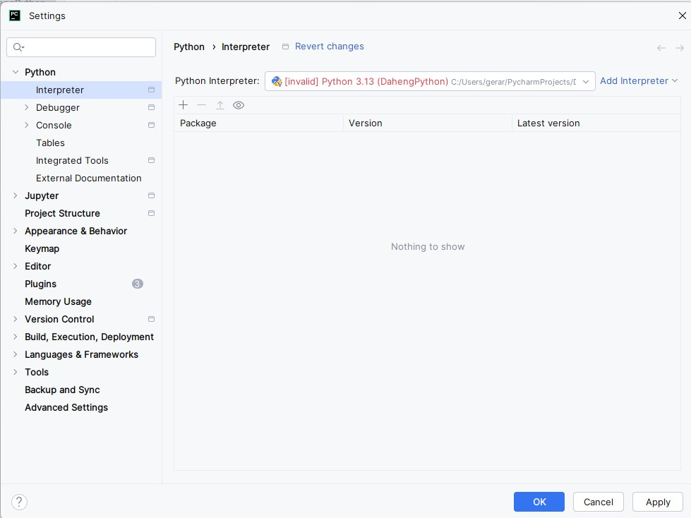

# Voorbereidingen


## Installatie Python
> Doe dit aleen als Python nog niet op je computer is geïnstalleerd.

Download de laatset versie van Python vanaf de [Python-website](https://www.python.org/downloads/).
Voer de installatie uit!
>Let op: 
>* Vink "Add Python to PATH" aan (belangrijk!)
>* Onthoud de installatielocatie (PyCharm zal ernaar vragen)


## Installatie PyCharm
PyCharm is een Integrated Development Environment om eenvoudig Python programmas te ontwikkelen'.
Download de laatste versie van Python vanaf de [PyCharm-website](https://www.jetbrains.com/pycharm/download/?section=windows)
Voer de installatie uit!

## Verkrijgen van de NodeMCU RPC Library
Je kunt de Library op twee manieren verkrijgen:
* Download als zip-bestand, er is nog geen versiebeheer met bijvoorbeeld Github mogelijk
* Fork maken in Github, hierna is de Library beschikbaar in je eigen Github account en kun je versiebheer met GIT uitvoeren.

:::::{card} 
::::{tab-set}
:::{tab-item} Zip-file
[Download NodeMCU RPC Library](https://github.com/AvansMechatronica/rpc_esp32/archive/refs/heads/main.zip)
Pak het bestand uit in een voor jou bekende map.
:::
:::{tab-item} GIT
* Maak een account aan bij [Github](https://github.com/) en login op dit account.

* Open de [NodeMCU RPC Library](https://github.com/AvansMechatronica/rpc_esp32) repository

* Maak een Fork van de repository naar je eigen Github account door op het **Fork icoon**  te klikken:


* Volg de instructies, maar wijzig de naam van de nieuwe repository niet. Bevestig met **Create Fork**

Navigeer in een command-console(cmd) naar een voor jou bekende map. Je kunt je repository verkrijgen door het volgende commando:
```cmd
git clone https://github.com/<jou_account_naam>/rpc_esp32
```

Je kunt vervolgens versiebeheer doen met de volgende command-console(cmd) commando's
* git add .
* git commit -m "jou bericht"
* git push
>Let op: Het gebruik van GIT wordt hier niet nader uitgelegd. Je kunt deze site raadplagen [Git Tutorial](https://www.w3schools.com/git/?utm_source=chatgpt.com)

:::
::: Downloaden
[Download link](https://github.com/AvansMechatronica/rpc_esp32/archive/refs/heads/main.zip)
:::
::::
:::::


## Python Environmet
Een Python-environment (omgeving) is eigenlijk een afzonderlijke “werkruimte” voor Python waarin je je programma’s draait en afhankelijkheden (libraries) installeert.

PyCharm maakt gebruik van virtuele environments:
* Een lokaal, geïsoleerd Python-systeem voor één project.
* Je installeert libraries alleen binnen dat environment.

## Project openen
Start het PyCharm programma en open met het programma de map van de DahengPython. 

### Maken van virtueele environment
Ga naar File-->Settings..
Swelecteer onder Python-->Interperer--Add Interpreter.

bevestig met *Ok*

>Er is nu een map ".venv" in je Project gemaakt

### Installeren van benodigde externe libraries
Open de PyCharm terminal window, door het juiste icoon te activeren(hieronder in blauw weergegeven, kan bij jezelf een andere kleur hebben)


>Controleer of de regel waarop je een commando kunt uitvoeren begint met (.env). Zo niet sluit PyCharm af en start het programma weer opnieuw.

Je kunt nu de externe libaries instaleren met het volgende commando
```bash
pip install -r .\requirements.txt
```

Hierna is de programmeeromgeving gereed voor gebruik. 😃Happy coding !!!

